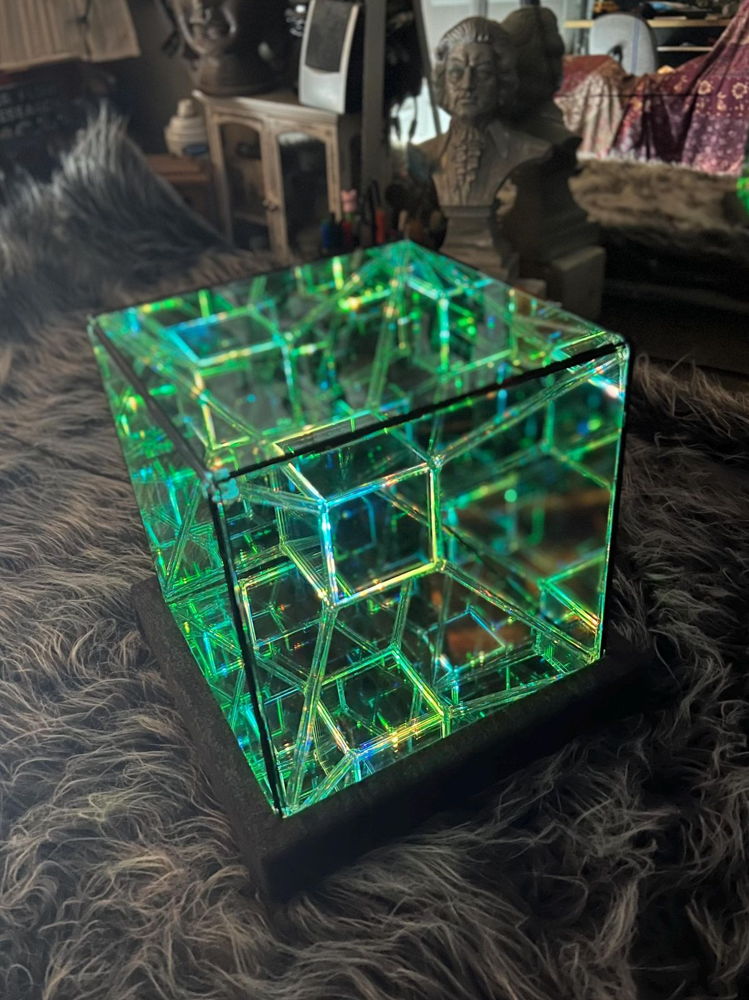
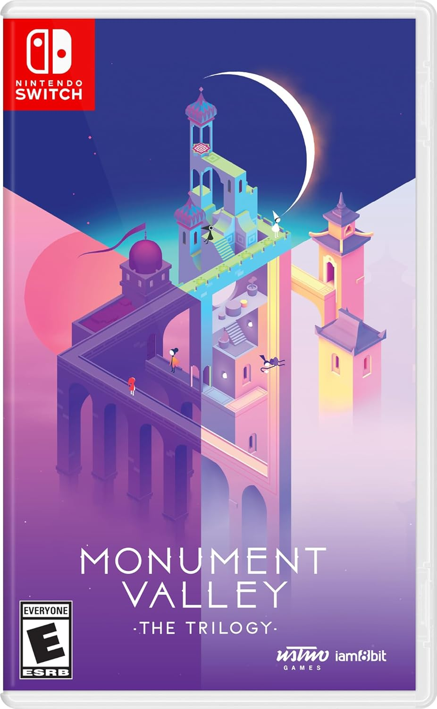
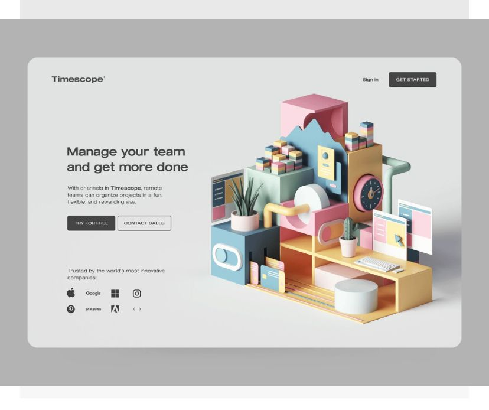
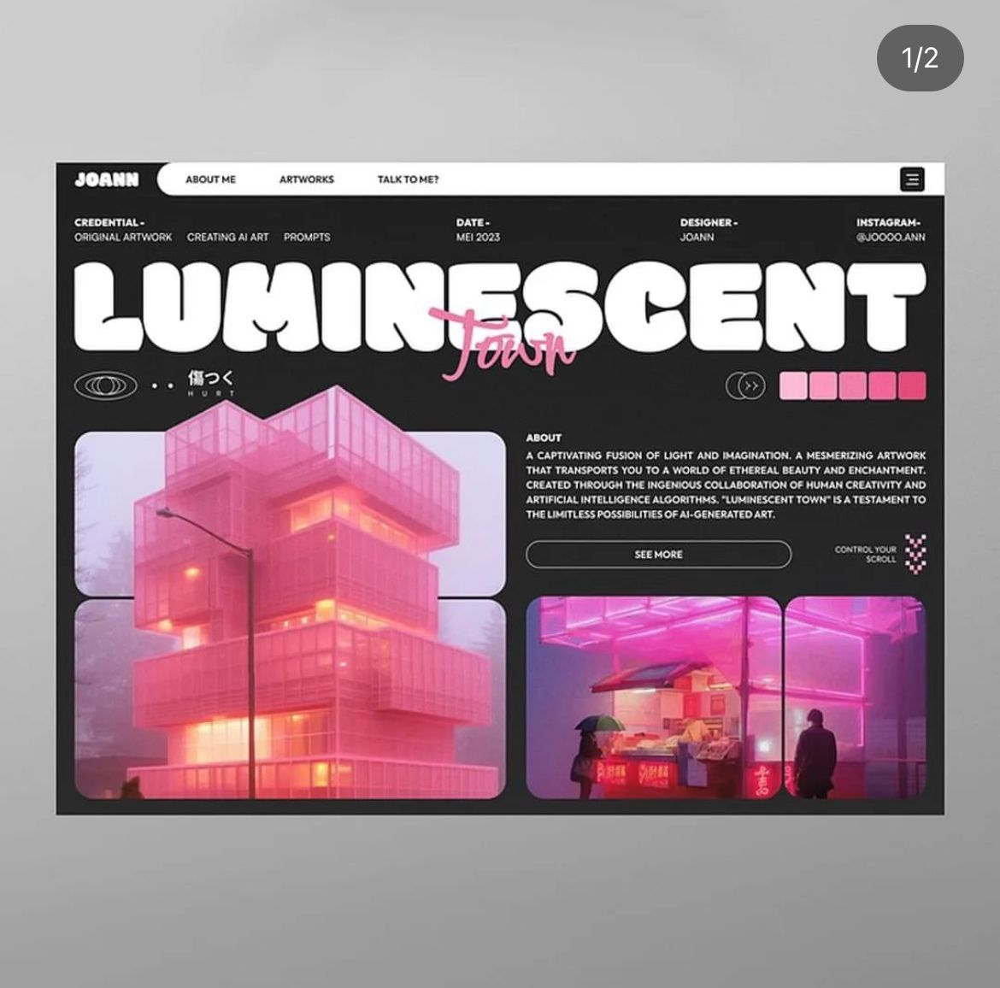

# The Second Golden Disk
### Core Lab & Core Studio Final Project

My biggest theme for this project is **‘collective fear of nonexistence’**. For this project, I am planning to create a physical object that contains abstract information about how I want to be portrayed to future intelligent beings. For the website, I will make a documentation that only I can open like a diary.

## Technical Plan

### Physical Object
The future I am imagining is a far future after current human beings are gone from the Earth,  and by then, the electronic devices would not work unless someone restores them. Therefore, I want the object I am creating not to require any physical computing or online components. Instead, I will be using double-sided mirrors, 3d printing, and possibly foam board or cardboard to create the structure of the physical object. Instead of LED lights, there will be glow-in-the-dark filament to show some parts of the objects only when it’s dark. Also, one of the most important part of this object is that it should not include human-made language, since we do not know who exactly will find this object

- double sided mirror
  - infinite mirror box in the middle of the object -> representative of the 4th dimension, which is related to 'time'
- glow-in-the-dark filament
  - used instead of LED lights for things to show inside the infinite mirror box when the lights are off
- 3d printing
  - used as the modern version of of 'engraving', like how our ancesters did to leave record of their life

### Website
For the website, I want it to include some interactive effects to make scrolling around random personal thoughts more interesting. I am not sure if I am allowed to use React-3-fiber or three.js for this project yet, but if possible, I would like to use 3d components in the website so that the user can scroll around the 3d model of the physical object on the website to see the description for each part of it. However, if I can not use 3d components or if I do not have enough time, I will be making the website in 2d using React.js. Also, since this is more of a personal project, I will be adding a password to open the website like a lock on a diary. 

#### Interactive Components
- scroll around 3d model(if possible)
  - react-three-fiber
  - three.js
- drag & drop images
  - [react-draggable](https://github.com/react-grid-layout/)
- different images each with effect(react.js use)
  - images of each parts of the object placed on the page
  - each images clicked -> description pop up opens  

-  Password Logic
    - (hopefully, the css would be designed like a diary lock if I have enough time)
```
<!--
Source - https://stackoverflow.com/a
I won't copy&paste this, this is just to help me with the logic
-->

<!DOCTYPE html>
<html>
<head>
    <title>Login page</title>
</head>
<body>
<form>
    <label for="pswd">Enter your password: </label>
    <input type="password" id="pswd">
    <input type="button" value="Submit" onclick="checkPswd();" />
</form>

<script type="text/javascript">
    function checkPswd() {
        var confirmPassword = "admin";
        var password = document.getElementById("pswd").value;
        if (password == confirmPassword) {
             window.location="welcome.html";
        }
        else{
            alert("Passwords do not match.");
        }
    }
</script>
</body>
</html>
```

 ### Object References
 


### Website References
[Dear Human](https://www.behance.net/gallery/219534331/Dear-Human-Research-Project)





